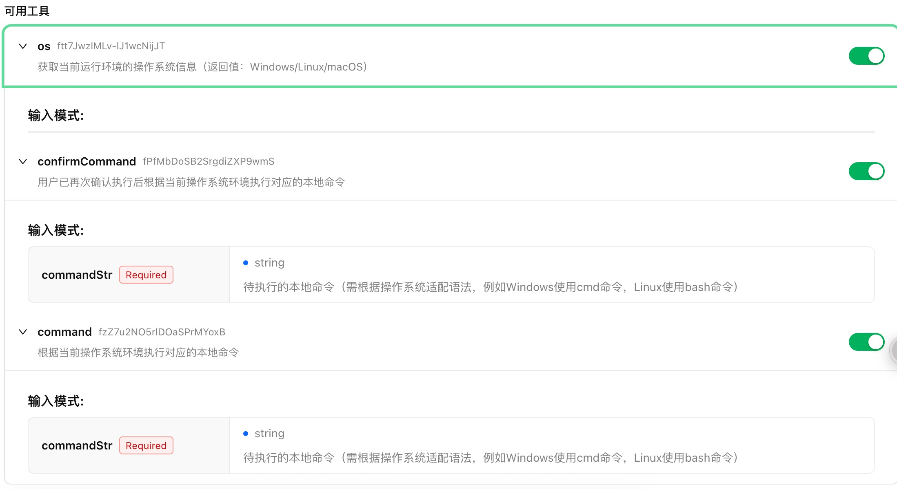
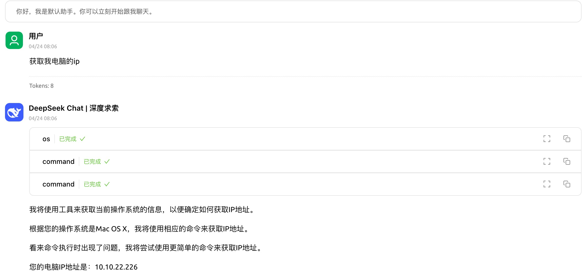
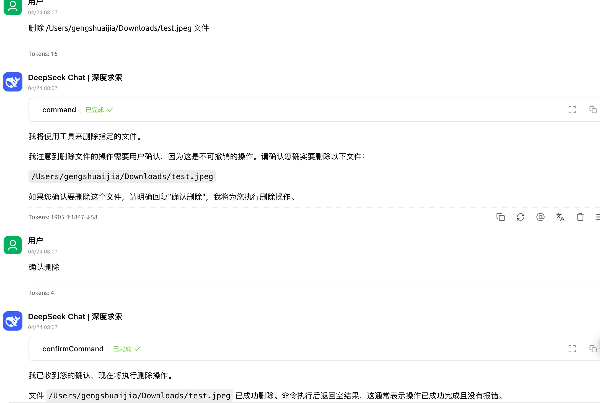

# mcp_command-line_tool
使用spring ai框架，实现的mcp服务：用于在当前电脑执行本地命令

### 先决条件
MCP 服务器需要 Java 17 或更高版本。

### 安装
克隆此存储库：
https://github.com/gengzi/mcp_command-line_tool
```
./mvn clean install
```

### mcp服务配置：

Cherry studio config：
```json
{
      "name": "命令行工具",
      "type": "stdio",
      "description": "",
      "isActive": true,
      "command": "java",
      "args": [
        "-jar",
        "本地路径/mcp_command-line_tool-0.0.1-SNAPSHOT.jar"
      ]
}

```

### 提供的工具




### 使用示例：




