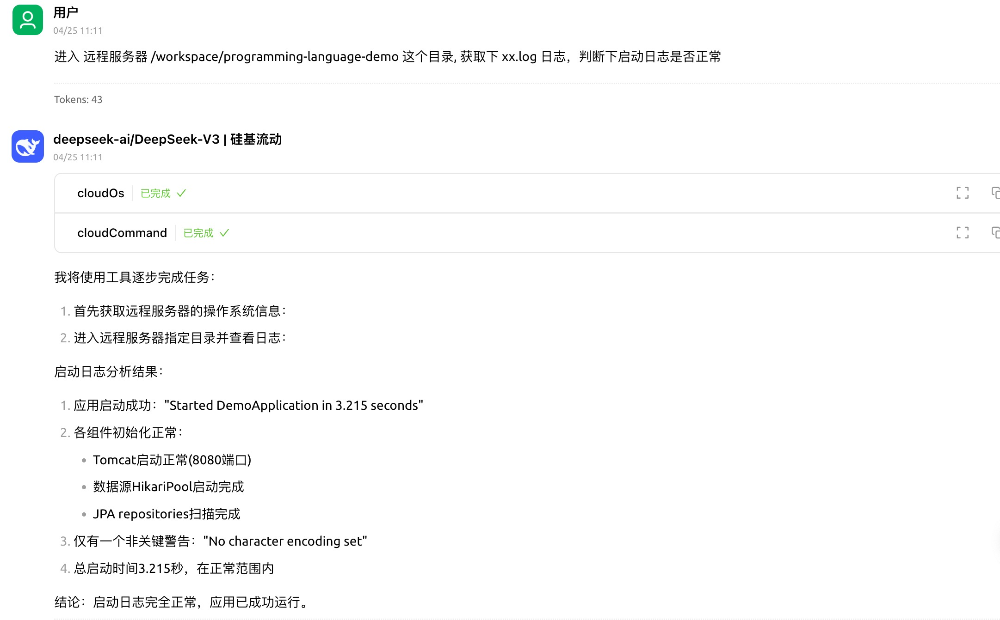

# mcp_command-line_tool
使用spring ai框架，实现的mcp服务：用于在当前电脑执行本地命令，也可以连接远程ssh，执行远程命令

### 先决条件
MCP 服务器需要 Java 17 或更高版本。

### 安装
克隆此存储库：
https://github.com/gengzi/mcp_command-line_tool
```
./mvn clean install
```

### 特别注意
执行命令时，仅仅拦截了rm 删除等操作，其他命令都未拦截。
如果操作不可撤销的命令时，请谨慎操作，由于是大模型来操作工具，可能操作不可撤销的命令。（有些命令不允许执行，只能手动执行）

### mcp服务配置

Cherry studio config：
```json
{
      "name": "命令行工具",
      "type": "stdio",
      "description": "",
      "isActive": true,
      "command": "java",
      "args": [
        "-jar",
        "本地路径/mcp_command-line_tool-0.0.1-SNAPSHOT.jar"
      ]
}

```
ssh配置：
支持私钥登录，也支持密码登录
* --ssh.passwd=密码
* --ssh.privatekeypath=私钥文件路径"
```json
{
      "name": "命令行工具",
      "type": "stdio",
      "description": "",
      "isActive": true,
      "command": "java",
      "args": [
        "-jar",
        "/Users/gengshuaijia/work/project/mcp/mcp_command-line_tool/target/mcp_command-line_tool-0.0.1-SNAPSHOT.jar",
        "--ssh.host=ssh.xxx地址",  
        "--ssh.username=用户名",
        "--ssh.privatekeypath=私钥文件路径",   
        "--ssh.port=22"
      ]
    }
```


### 提供的工具


### 使用示例：
* 本地命令行


* 远程命令行


